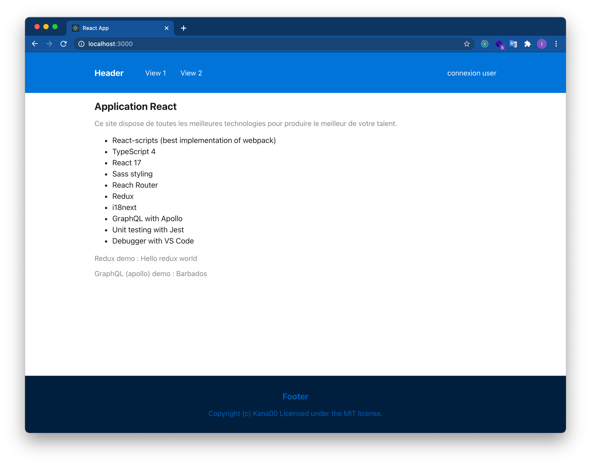

# web site new project


<p align='center'></p>

## Overview

This site has all the best technologies to produce de best of your talent

- webpack 4
- TypeScript 3
- React 16
- Sass styling
- Reach Router (better than React router)
- Redux
- I18next
- GraphQL with Apollo
- Unit Testing with Jest
- Debugger with VS Code

## Installation

You will need to install the following modules for optimization reasons

```sh
# install node JS here: https://nodejs.org/en/download/
# install yarn here: https://classic.yarnpkg.com/en/docs/install
# install ngrok here: https://ngrok.com/download
> yarn global add npx cross-env
> cd WHERE_IS_THE_PROJECT
> yarn install
> yarn start
```

## License

Copyright (c) Kana00. All rights reserved.

Licensed under the MIT license.
